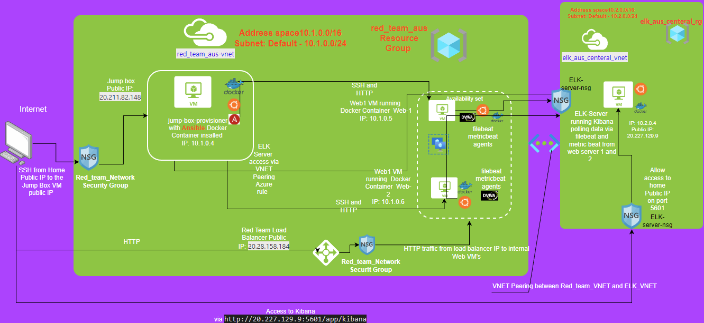

## **Automated ELK Stack Deployment**

The files in this repository were used to configure the network depicted below.

 
These files have been tested and used to generate a live ELK deployment on Azure. They can be used to either recreate the entire deployment pictured above. Alternatively, select portions of the **.YML** file may be used to install only certain pieces of it, such as Filebeat.

  - [ELK Install Playbook ](/Ansible/install-elk.yml)
  - [Filebeat Install Playbook ](/Ansible/filebeat-playbook.yml)
  - [Metricbeat Install Playbook](/Ansible/metricbeat-playbook.yml)

This document contains the following details:
- Description of the Topology
- Access Policies
- ELK Configuration
  - Beats in Use
  - Machines Being Monitored
- How to Use the Ansible Build


### **Description of the Topology**

The main purpose of this network is to expose a load-balanced and monitored instance of DVWA, the D*mn Vulnerable Web Application.

Load balancing ensures that the application will be highly available, in addition to restricting access to port 80 to the network.
- Load Balancers works as a revere proxy which in terms they are the public facing rather then exposing servers directly and also load balancer only communicates on the didcated front end ports and back end ports to the Web Servers which in terms addes layer of secuirty. 
- Jumpbox is the Server/Host which is ideally the only box exposed to the internet rather then Production Server which then can be attacked from the Internet. If we want to take Security bit more further we can create a seperate DMZ Network and keep Jumpbox over there and then allow any interacation to the internal servers via more tighter Access Control List on the Firewall.

Integrating an ELK server allows users to easily monitor the vulnerable VMs for changes to the _____ and system _____.
- **Filebeat** - Monitors Log Files and File System Changes
- **Metricbeat** - Monitors CPU Usage, Disk IO, Network IO, Memory

The configuration details of each machine may be found below.

| Name                                         | Function                                                                                                           | IP Address  | Operation System     |
|----------------------------------------------|--------------------------------------------------------------------------------------------------------------------|-------------|----------------------|
| Jump Box  Jump-Box-Provisioner               | Jump Box for for SSH from the Internet  also Ansible Container to deploy and push configuraiton via Ansible files  | 10.1.0.4    | Linux (ubuntu 20.04) |
| Web Server Web-1                             | DVWA Damn Vulnerable Web Application Web Server                                                                    | 10.1.0.5    | Linux (ubuntu 20.04) |
| Web Server  Web-2                            | DVWA Damn Vulnerable Web Application Web Server                                                                    | 10.1.0.6    | Linux (ubuntu 20.04) |
| Elastic Search and Kabana Server Elk Server  | Elasticsearch, Logstash, and Kibana Server                                                                         | 10.2.0.4    | Linux (ubuntu 20.04) |


### **Access** **Policies** 

The machines on the internal network are not exposed to the public Internet. 

Only the Jump-Box-Provisioner Virtual machine can accept connections from the Internet and only. Access to this machine is only allowed from the following IP addresses:
- My Peronal Public IP (This can be determiend by https://whatismyipaddress.com/ ) 

Machines within the network can only be accessed by JUmp-Box-Provisioner only.
Internally due to VNET pearing which is been setup between two VNETS ELK can be accessed internally via SSH. ELK VM has a public IP assigned and it can be accessable only from personal Public IP as determined above and only via Port 5601

A summary of the access policies in place can be found in the table below.
| Name                                         | Publicly Accessible | Allowed IP Address          |
|----------------------------------------------|---------------------|-----------------------------|
| Jump Box  Jump-Box-Provisioner               | Yes                 | Personal Public IP          |
| Load Balancer                                | Yes                 | Personal Public IP          |
| Web Server Web-1                             | No                  | 10.1.0.0/24 and 10.2.0.0/24 |
| Web Server  Web-2                            | No                  | 10.1.0.0/24 and 10.2.0.0/24 |
| Elastic Search and Kabana Server Elk Server  | Yes                 | Personal Public IP          |

### **Elk Configuration**

Ansible was used to automate configuration of the ELK machine. No configuration was performed manually, which is advantageous because it automates installation and we can use same playbook for similar installation in the future or perform installation on multiple Server if needed


The playbook implements the following tasks:

* Install docker.io, pip3 using apt module and docker python module

```bash
  # Use apt module
    - name: Install docker.io
      apt:
        update_cache: yes
        name: docker.io
        state: present

  # Use apt module
    - name: Install pip3
      apt:
        force_apt_get: yes
        name: python3-pip
        state: present

  # Use pip module
    - name: Install Docker python module
      pip:
        name: docker
        state: present
```   

* Increase vitrual memory and apply it on restart 

```bash
    # Use command module
  - name: Increase virtual memory
    sysctl:
      name: vm.max_map_count
      value: '262144'
      state: present
      reload: yes

    # Use shell module
  - name: Increase virtual memory on restart
    shell: echo "vm.max_map_count=262144" >> /etc/sysctl.conf


```

* Install ELK docker container and also set it to restart as a service 
```bash
    # Use docker_container module
  - name: download and launch a docker elk container
    docker_container:
      name: elk
      image: sebp/elk:761
      state: started
      restart_policy: always
      published_ports:
        - 5601:5601
        - 9200:9200
        - 5044:5044
# This will automatically restart Docker Services
  - name: Enable docker service
    systemd:
      name: docker
      enabled: yes

```
The following screenshot displays the result of running `docker ps` after successfully configuring the ELK instance.


### **Target Machines & Beats**
This ELK server is configured to monitor the following machines:
- Web 1 - 10.1.0.5
- Web 2 - 10.1.0.6

We have installed the following Beats on these machines:
- Filebeat 
- Metricbeat 

These Beats allow us to collect the following information from each machine:

- **Filebeat** - Filebeat is a lightweight shipper of forwarding and centrilizaing log data, it is installed as an agent on Servers. It monitors log files or log files within specific location collects them and then forwared to ElasticSearch or Logstash for indxing 

- **Metricbeat** - Metric beat is also a lightweight shipper of metrics like CPU usage, Memory, File System, DIsko IO, Network IO. Metricbeat is installed as an agent on the Server and ships the meterics specified 

### **Using the Playbook**
In order to use the playbook, you will need to have an Ansible control node already configured. Assuming you have such a control node provisioned: 

SSH into the control node and follow the steps below:
- Copy the configuration file to /etc/ansible
- Update the /etc/ansible/hosts file to include ElK server and Web Servers
- Run the playbook, and navigate to http://20.227.129.9:5601/app/kibana (IP address could change depends on your ELK Server Public IP) to check that the installation worked as expected.


- _Which file is the playbook? Where do you copy it?     **install-elk.yml** 
- _Which file do you update to make Ansible run the playbook on a specific machine?  How do I specify which machine to install the ELK server on versus which to install Filebeat on?
 We specify Web Servers and ELK Servers in  **/etc/ansible/hosts**

 ```bash
 [webservers]
#alpha.example.org
#beta.example.org
#192.168.1.100
#192.168.1.110
10.1.0.5 ansible_python_interpreter=/usr/bin/python3
10.1.0.6 ansible_python_interpreter=/usr/bin/python3


[elk]
 10.2.0.4 ansible_python_interpreter=/usr/bin/python3
 ```
 from here when we run playbook for elk **install-elk.yml** it will install ELK as we specified host name in the **/etc/ansible/hosts** file 

 ```bash
 - name: Configure Elk VM with Docker
  hosts: elk
  remote_user: azadmin
  become: true

 ```

 Also we specify in our **filebeat-playbook.yaml** where to intall the agent, and playbook will pickup information from the **/etc/ansible/hosts** file 

 ```bash
---
- name: Installing and Launch Filebeat
  hosts: webservers
  become: yes


 ```


- _Which URL do you navigate to in order to check that the ELK server is running? http://20.227.129.9:5601/app/kibana


----------------------------


 # **Bonus** Installtion setups and guide 

 
 
 whole setup requires below steps after virtual machine setup is done and Network security group is configured.

  1. Setup Jumpbox with Ansible Docker Container 
  2. Setup ELK Server with ELK Docker Container with the necessary ports etc. using Ansible file which is run from the Docker Contianer on the Jumpbox 
  3. Install filebeat and metricbeat on both Web-1 and Web-2 VM and run the metrics to ELK Server


 
  

- Refering to the Diagram and afer our Network Security Group Setup in Azure we have made sure that only SSH access to our Azure Enivornment is via Jumpbox Public IP and that too accessable only via your personal Public IP address. 

Command to SSH via GitBash or Terminal is below.

```bash
#PublicIP is the IP of your Jumbox Virtual Machine in Azure, make sure you are in the same directory where you have saved your private key for your Jumpbox VM
ssh  azadmin@publicIP

```
- Once you are in your Jumpbox, you will have to make sure that Docker is installed and setup on your Jumpbox to install Container some of the commands as per below: 

```bash
sudo apt update 
apt install docker.io
#(To check docker is running)
sudo systemctl status docker 
#(To check docker is running)
sudo systemctl start docker 
sudo docker pull cyberxsecurity/ansible
docker run -ti cyberxsecurity/ansible:latest bash
```

Need to now connect to the Docker Container: 

```bash
sudo docker start ""<Your Docker Container Name>""
 sudo docker attach ""<Your Docker Container Name>""
```

Once in the Docker Container go to /etc/ansible/ modify **hosts** file  example below: 

```bash
# This is the default ansible 'hosts' file.
#
# It should live in /etc/ansible/hosts
#
#   - Comments begin with the '#' character
#   - Blank lines are ignored
#   - Groups of hosts are delimited by [header] elements
#   - You can enter hostnames or ip addresses
#   - A hostname/ip can be a member of multiple groups

# Ex 1: Ungrouped hosts, specify before any group headers.

#green.example.com
#blue.example.com
#192.168.100.1
#192.168.100.10

# Ex 2: A collection of hosts belonging to the 'webservers' group

[webservers]
#alpha.example.org
#beta.example.org
#192.168.1.100
#192.168.1.110
10.1.0.5 ansible_python_interpreter=/usr/bin/python3
10.1.0.6 ansible_python_interpreter=/usr/bin/python3


[elk]
 10.2.0.4 ansible_python_interpreter=/usr/bin/python3

# If you have multiple hosts following a pattern you can specify
# them like this:

#www[001:006].example.com

# Ex 3: A collection of database servers in the 'dbservers' group

#[dbservers]
#
#db01.intranet.mydomain.net
#db02.intranet.mydomain.net
#10.25.1.56
#10.25.1.57

# Here's another example of host ranges, this time there are no
# leading 0s:

#db-[99:101]-node.example.com

```
Make sure you are in /etc/ansible directory within your Docker Container and run below playbook to install ELK module on your ELK-Server by running command 

- ansible-playbook install-elk.yml

```bash

- name: Configure Elk VM with Docker
  hosts: elk
  remote_user: azadmin
  become: true
  tasks:
    # Use apt module
  - name: Install docker.io
    apt:
#      force_apt_get: yes
      update_cache: yes
      name: docker.io
      state: present

    # Use apt module
  - name: Install pip3
    apt:
      force_apt_get: yes
      name: python3-pip
      state: present

    # Use pip module
  - name: Install Docker python module
    pip:
      name: docker
      state: present

    # Use command module
  - name: Increase virtual memory
    sysctl:
      name: vm.max_map_count
      value: '262144'
      state: present
      reload: yes

    # Use shell module
  - name: Increase virtual memory on restart
    shell: echo "vm.max_map_count=262144" >> /etc/sysctl.conf

    # Use docker_container module
  - name: download and launch a docker elk container
    docker_container:
      name: elk
      image: sebp/elk:761
      state: started
      restart_policy: always
      published_ports:
        - 5601:5601
        - 9200:9200
        - 5044:5044
# This will automatically restart Docker Services
  - name: Enable docker service
    systemd:
      name: docker
      enabled: yes

```


- After installation is successful please verify that you can access ELK URL as per below.
 
      http://[your.ELK-VM.External.IP]:5601/app/kibana
- Next step is to install Filebeat and Metricbeat on both Web-1 and Web-2 VM

before we run Playbook for installation of Filebeat and Metricbeat we need to run below command while in /etc/ansible directory within docker contianer while on Jumpbox VM 

### **FOR FILEBEAT CONFIGURATION FILE AND YML FILE SETUP AND INSTALL**
```bash
curl https://gist.githubusercontent.com/slape/5cc350109583af6cbe577bbcc0710c93/raw/eca603b72586fbe148c11f9c87bf96a63cb25760/Filebeat >> /etc/ansible/filebeat-config.yml
```
Because we are connecting your webVM's to the ELK server, we need to edit the file to include your ELK server's IP address.

Note that the default credentials are elastic:changeme and should not be changed at this step.


Scroll to line #1106 and replace the IP address with the IP address of your ELK machine.

```bash
output.elasticsearch:
hosts: ["10.2.0.4:9200"]
username: "elastic"
password: "changeme"
```

Scroll to line #1806 and replace the IP address with the IP address of your ELK machine.

```bash
setup.kibana:
host: "10.2.0.4:5601"
```

Save this file in  /etc/ansible/files/filebeat-config.yml.
After you have edited the file, your settings should resemble the below. Your IP address may be different, but all other settings should be the same, including ports.

```bash
output.elasticsearch:
hosts: ["10.2.0.4:9200"]
username: "elastic"
password: "changeme"
```
```bash
setup.kibana:
host: "10.2.0.4:5601"
```
- Create Filebeat Playbook within /etc/ansible/roles directory name **filebeat-playbook.yml**

```bash

- name: Installing and Launch Filebeat
  hosts: webservers
  become: yes
  tasks:
    # Use command module
  - name: Download filebeat .deb file
    command: curl -L -O https://artifacts.elastic.co/downloads/beats/filebeat/filebeat-7.6.1-amd64.deb

    # Use command module
  - name: Install filebeat .deb
    command: dpkg -i filebeat-7.4.0-amd64.deb

    # Use copy module
  - name: Drop in filebeat.yml
    copy:
      src: /etc/ansible/filebeat-config.yml
      dest: /etc/filebeat/filebeat.yml

    # Use command module
  - name: Enable and Configure System Module
    command: filebeat modules enable system

    # Use command module
  - name: Setup filebeat
    command: filebeat setup

    # Use command module
  - name: Start filebeat service
    command: service filebeat start

   # Use systemd module
  - name: enable service filebeat on boot
    systemd:
      name: filebeat
      enabled: yes


```

- once done run this command from /etc/ansible/roles dirctory  to install Filebeat on both Web-1 and Web-2
 
       ansible-playbook filebeat-playbook.yml


### **FOR METRICBEAT CONFIGURAITON AND YML FILE SETUP AND INSTALL**

```bash
curl https://gist.githubusercontent.com/slape/58541585cc1886d2e26cd8be557ce04c/raw/0ce2c7e744c54513616966affb5e9d96f5e12f73/metricbeat > /etc/ansible/metricbeat-config.yml
```

- Edit metric-beat.yml and edit line 61 and 62 as per below: 

```bash
 setup.kibana:
 host: "10.2.0.4:5601"
```
 - On line 93 95 and 97

```bash
#-------------------------- Elasticsearch output ------------------------------
 output.elasticsearch:
 # Array of hosts to connect to.
 hosts: ["10.2.0.4:9200"]
 username: "elastic"
 password: "changeme"

```
- Create Metricbeat Playbook within /etc/ansible/roles directory name **metricbeat-playbook.yml**

```bash
---
- name: Install metric beat
  hosts: webservers
  become: true
  tasks:
    # Use command module
  - name: Download metricbeat
    command: curl -L -O https://artifacts.elastic.co/downloads/beats/metricbeat/metricbeat-7.6.1-amd64.deb

    # Use command module
  - name: install metricbeat
    command: dpkg -i metricbeat-7.4.0-amd64.deb

    # Use copy module
  - name: drop in metricbeat config
    copy:
      src: /etc/ansible/metricbeat-config.yml
      dest: /etc/metricbeat/metricbeat.yml

    # Use command module
  - name: enable and configure docker module for metric beat
    command: metricbeat modules enable docker

    # Use command module
  - name: setup metric beat
    command: metricbeat setup

    # Use command module
  - name: start metric beat
    command: service metricbeat start

  - name: enable service metricbeat on boot
    systemd:
      name: metricbeat
      enabled: yes

```
- once done run this command from /etc/ansible/roles dirctory  to install Metricbeat on both Web-1 and Web-2
 
       ansible-playbook metricbeat-playbook.yml


