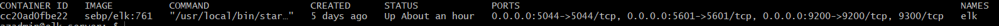

## **Automated ELK Stack Deployment**

The files in this repository were used to configure the network depicted below.


These files have been tested and used to generate a live ELK deployment on Azure. They can be used to either recreate the entire deployment pictured above. Alternatively, select portions of the _____ file may be used to install only certain pieces of it, such as Filebeat.

  - _TODO: Enter the playbook file._

This document contains the following details:
- Description of the Topologu
- Access Policies
- ELK Configuration
  - Beats in Use
  - Machines Being Monitored
- How to Use the Ansible Build


### **Description of the Topology**

The main purpose of this network is to expose a load-balanced and monitored instance of DVWA, the D*mn Vulnerable Web Application.

Load balancing ensures that the application will be highly _____, in addition to restricting _____ to the network.
- _TODO: What aspect of security do load balancers protect? What is the advantage of a jump box?_

Integrating an ELK server allows users to easily monitor the vulnerable VMs for changes to the _____ and system _____.
- _TODO: What does Filebeat watch for?_
- _TODO: What does Metricbeat record?_

The configuration details of each machine may be found below.
_Note: Use the [Markdown Table Generator](http://www.tablesgenerator.com/markdown_tables) to add/remove values from the table_.

| Name                                         | Function                                                                                                           | IP Address  | Operation System     |
|----------------------------------------------|--------------------------------------------------------------------------------------------------------------------|-------------|----------------------|
| Jump Box  Jump-Box-Provisioner               | Jump Box for for SSH from the Internet  also Ansible Container to deploy and push configuraiton via Ansible files  | 10.1.0.4    | Linux (ubuntu 20.04) |
| Web Server Web-1                             | DVWA Damn Vulnerable Web Application Web Server                                                                    | 10.1.0.5    | Linux (ubuntu 20.04) |
| Web Server  Web-2                            | DVWA Damn Vulnerable Web Application Web Server                                                                    | 10.1.0.6    | Linux (ubuntu 20.04) |
| Elastic Search and Kabana Server Elk Server  | Elasticsearch, Logstash, and Kibana Server                                                                         | 10.2.0.4    | Linux (ubuntu 20.04) |


### **Access** **Policies** 

The machines on the internal network are not exposed to the public Internet. 

Only the Jump-Box-Provisioner Virtual machine can accept connections from the Internet and only. Access to this machine is only allowed from the following IP addresses:
- My Peronal Public IP (This can be determiend by https://whatismyipaddress.com/ ) 

Machines within the network can only be accessed by JUmp-Box-Provisioner only.
Internally due to VNET pearing which is been setup between two VNETS ELK can be accessed internally via SSH. ELK VM has a public IP assigned and it can be accessable only from personal Public IP as determined above and only via Port 5601

A summary of the access policies in place can be found in the table below.
| Name                                         | Publicly Accessible | Allowed IP Address          |
|----------------------------------------------|---------------------|-----------------------------|
| Jump Box  Jump-Box-Provisioner               | Yes                 | Personal Public IP          |
| Load Balancer                                | Yes                 | Personal Public IP          |
| Web Server Web-1                             | No                  | 10.1.0.0/24 and 10.2.0.0/24 |
| Web Server  Web-2                            | No                  | 10.1.0.0/24 and 10.2.0.0/24 |
| Elastic Search and Kabana Server Elk Server  | Yes                 | Personal Public IP          |

### **Elk Configuration**

Ansible was used to automate configuration of the ELK machine. No configuration was performed manually, which is advantageous because it automates installation and we can use same playbook for similar installation in the future or perform installation on multiple Server if needed


The playbook implements the following tasks:

* Install docker.io, pip3 using apt module and docker python module

```bash
  # Use apt module
    - name: Install docker.io
      apt:
        update_cache: yes
        name: docker.io
        state: present

  # Use apt module
    - name: Install pip3
      apt:
        force_apt_get: yes
        name: python3-pip
        state: present

  # Use pip module
    - name: Install Docker python module
      pip:
        name: docker
        state: present
```   

* Increase vitrual memory and apply it on restart 

```bash
    # Use command module
  - name: Increase virtual memory
    sysctl:
      name: vm.max_map_count
      value: '262144'
      state: present
      reload: yes

    # Use shell module
  - name: Increase virtual memory on restart
    shell: echo "vm.max_map_count=262144" >> /etc/sysctl.conf


```

* Install ELK docker container and also set it to restart as a service 
```bash
    # Use docker_container module
  - name: download and launch a docker elk container
    docker_container:
      name: elk
      image: sebp/elk:761
      state: started
      restart_policy: always
      published_ports:
        - 5601:5601
        - 9200:9200
        - 5044:5044
# This will automatically restart Docker Services
  - name: Enable docker service
    systemd:
      name: docker
      enabled: yes

```
The following screenshot displays the result of running `docker ps` after successfully configuring the ELK instance.



### **Target Machines & Beats**
This ELK server is configured to monitor the following machines:
- Web 1 - 10.1.0.5
- Web 2 - 10.1.0.6

We have installed the following Beats on these machines:
- Filebeat 
- Metricbeat 

These Beats allow us to collect the following information from each machine:

- **Filebeat** - Filebeat is a lightweight shipper of forwarding and centrilizaing log data, it is installed as an agent on Servers. It monitors log files or log files within specific location collects them and then forwared to ElasticSearch or Logstash for indxing 

- **Metricbeat** - Metric beat is also a lightweight shipper of metrics like CPU usage, Memory, File System, DIsko IO, Network IO. Metricbeat is installed as an agent on the Server and ships the meterics specified 

### **Using the Playbook**
In order to use the playbook, you will need to have an Ansible control node already configured. Assuming you have such a control node provisioned: 

SSH into the control node and follow the steps below:
- Copy the configuration file to /etc/ansible
- Update the /etc/ansible/hosts file to include ElK server and Web Servers
- Run the playbook, and navigate to http://20.227.129.9:5601/app/kibana (IP address could change depends on your ELK Server Public IP) to check that the installation worked as expected.

_TODO: Answer the following questions to fill in the blanks:_
- _Which file is the playbook? Where do you copy it?     **install-elk.yml** 
- _Which file do you update to make Ansible run the playbook on a specific machine? 
 - How do I specify which machine to install the ELK server on versus which to install Filebeat on? We specify Web Servers and ELK Servers in  **/etc/ansible/hosts**

 ```bash
 [webservers]
#alpha.example.org
#beta.example.org
#192.168.1.100
#192.168.1.110
10.1.0.5 ansible_python_interpreter=/usr/bin/python3
10.1.0.6 ansible_python_interpreter=/usr/bin/python3


[elk]
 10.2.0.4 ansible_python_interpreter=/usr/bin/python3
 ```
 from here when we run playbook for elk **install-elk.yml** it will install ELK as we specified host name in the **/etc/ansible/hosts** file 

 ```bash
 - name: Configure Elk VM with Docker
  hosts: elk
  remote_user: azadmin
  become: true

 ```

 Also we specify in our **filebeat-playbook.yaml** where to intall the agent, and playbook will pickup information from the **/etc/ansible/hosts** file 

 ```bash
---
- name: Installing and Launch Filebeat
  hosts: webservers
  become: yes


 ```


- _Which URL do you navigate to in order to check that the ELK server is running? http://20.227.129.9:5601/app/kibana

_As a **Bonus**, provide the specific commands the user will need to run to download the playbook, update the files, etc._